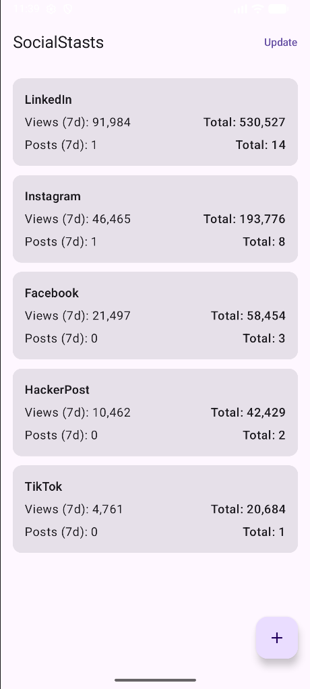
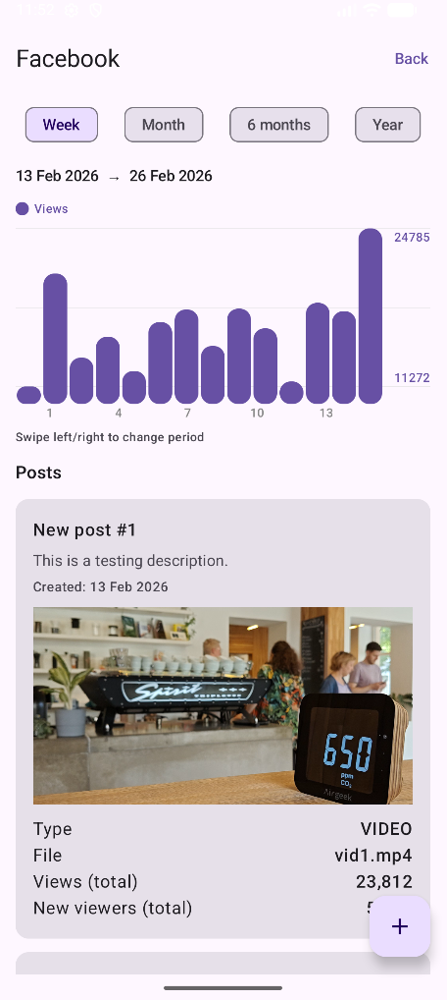
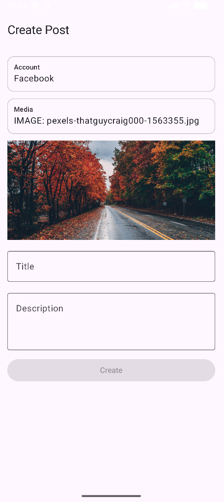

# Social Stats App
As my final application for this class, I have decided to create an application that will
be later used in my company mainly for internal use. We were frustrated that we have to keep
track of multiple social accounts at once, to get feedback on our Kickstarter campaign. Viewing
all accounts and checking responses or creating new content can be hard when you have
over 10 accounts.

The main idea of this app is to connect all those accounts together, with single Android
application, which will recieve all needed data from our server, where we will be scraping/accessing
all neccesary data and converting them to some common format (probably JSON). The app serves
as client counterpart.

## User documentation
Because of the reasons above, the application is made as simple to use as possible and consists
of three pages, described below.

### Main page
As we can see in the image bellow, the main page provides simple overview of all tracked accounts in
form of a panel per account. Each account panel(card) then contains basic information about total account
views and number of posts. For more information about each account, you can tap these panels, which will 
navigate you to <strong>Account View</strong> page with detailed statictics about account statistics
over time and posts associated with this account.  

The update button triggers data synchronization (in our case, creating new testing data) and thus updating
existing stats, adding new posts or tracked accounts.

Since our goal is not only to display but also create posts, you can achieve that via floating plus button
in the right down corner of the page. If you tap this button from the main page, the 
<strong>Create Post</strong> page will be preconfigured to associate the new post with all tracked accounts
(you can change it directly on the page, so nothing is set in stone). As we will see in description
of next page, you can also create explicitely for given account.

### Account View page
At the top of this page, you can see a bar chart showing the total number of the account views over time.
By default the visible range of the chart is limited to one week, but you can change the level of detail with 
buttons placed above the chart. The chart supports the swipe gesture for moving selected frame on the
timeline with a date range above the chart, so you always know the range you are looking at.

If you want to see the exact value of the bar you can diplay in by tapping the bar.

Below the chart, you can see example of the post detail panel which diplays basic information
about each associated post. Since the following distinction is critical, I will now describe:
- <strong>Title</strong> at the top serves only for user as his own alias for the post (so it is faster to spot).
- <strong>Description</strong> below is the actual "text" of the post, which will be displayed on socials.
- For description of other parameters see the technical documentation.

Posts are displayed in scrollable panel, ordered from newest to oldest. In future version, I would like 
to implement filtering methods, so you do not have to view all the post at once

As mentioned in section about the Main page, you can create post specificaly for the viewed account
via floating plus button in the right down corner.

### Create Post page
The last page, as the name suggests, is all about creating new post so that you have to only select account/s
and content of your post. The account selection is realized via drop down menu on top. For now, you can 
select all or a single account. Under that you have a media picker, which will invoke system media picker
where you can select one. Selecting media and title is required for the post to be created.

After you hit create, new post is stored in the database. In the future version will be also uploaded 
to our server.

## Tech documentation
This program is a simplification of the problem described above in the sence of that I completely
omitted the server side of the utility by mocking all the necessary data. The application capabilities
are pretty similar to desired final state, but some details will be improved in future based on
our "user" experience.

### Data composition, generation and storage
Most of the popular social platforms have a common characteristics for posts which are media + text.
For our internal purposes and information value, I have decided to store few more values:

- <strong>Description</strong> is the text part of the actual post.
- <strong>Media</strong> is the URI of included media (Video/Image) of the post.
- <strong>Title</strong> serves as a shortcut for user to quickly identify the post.
- <strong>MediaType</strong> once again just for user to easily identify the type of used media.
- <strong>CreatedAt</strong> is the day and time of post creation (mainly for user, but also for sorting)
- <strong>Views</strong> represent the total sum of the views associated with current post.

Each of those post is then associated with specific account/s for which we store only the name of the
account for now. 

For the reason described above, all data are generated (Mocked) in this version of the application, so
we could test all it's functionalities. Fo that purpouse there are classes <strong>MockData</strong>:
  - Generates new posts and post views updates .
  - Can generate post belonging to account, that is not known to the application. In such case, it will
    create new acount, based on the name in the post.
  - For simplicity, the new accounts can come only from preselected array of account names.
  - Post and accounts(post with unkown name) are created with certain probability(50% for post and 15%
    for new account) in attempt to match real life scenario.
  - Otherwise each update generates post update with new views on the post.
 
 and <strong>MediaSeeder</strong>:
   - "Helper" to <strong>MockData</strong> class in the sense of providing media files.
   - Since we mock all incoming data, I have decided to store few default media files directly in the
     project repository (app/assets/mock_media) so when the application has it's own folder empty, we
    copy those images to device (emulator). That way I can provide you with better demonstation
    of application capabilities, because we use those media in newly generated (mocked) posts.

### Bar chart
The visualisation of the statistics is realized via my company's <strong>BarChart</strong> class, which
I only slightly enhanced. Chart shows sums of view per day with changeable range of view (Day, Week,
Month, 6 Months, Year). Each of shown bars should be able to show precise ammount of views after tap.

Because original class did not contain support for scrolling/swiping, I decided to add this functionality
so that you can swipe left and right on the chart and shift the observed range by same ammount in that
direction (swiping is limited to not go in the future).

